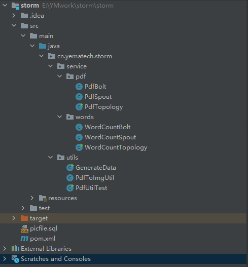
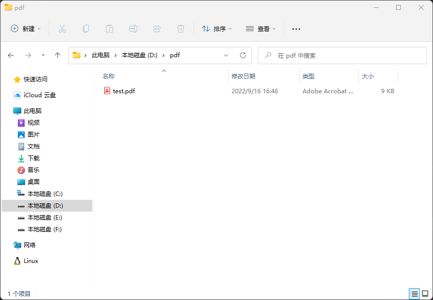
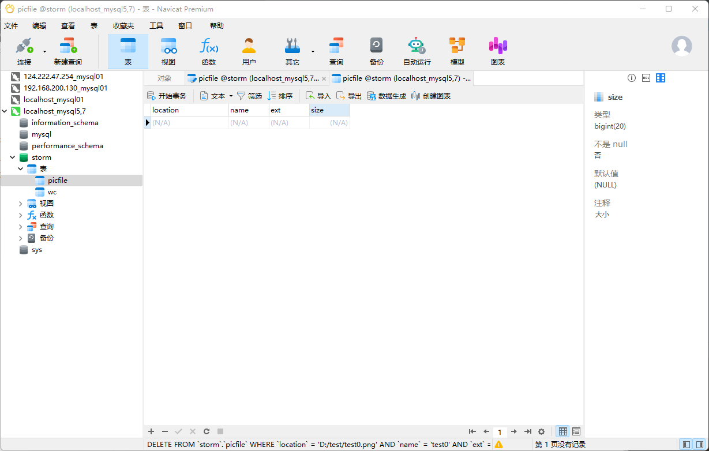
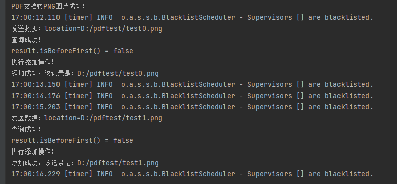
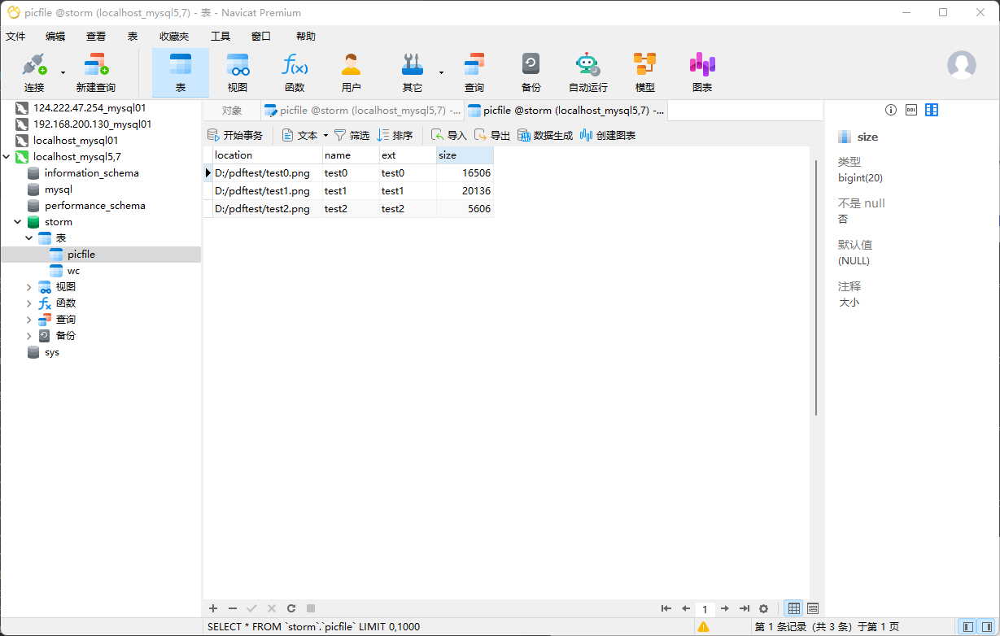
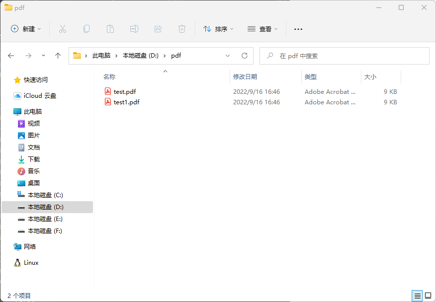
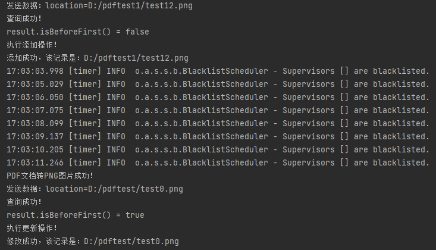
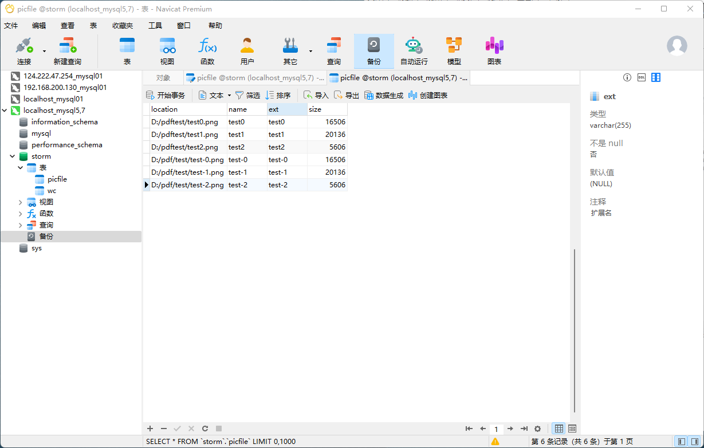
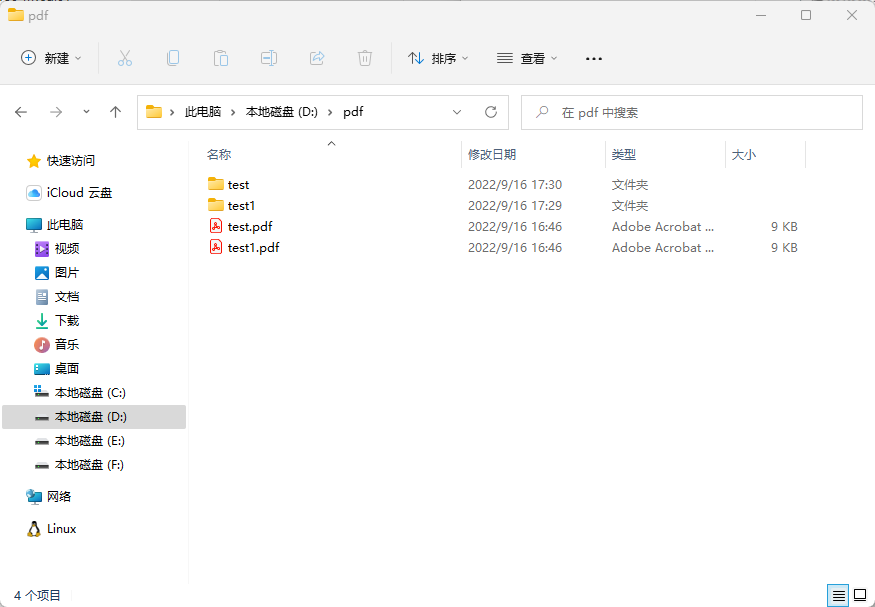

## 1.环境

Java1.8

MySQL5.7

## 2.使用

### 2.1 目录结构

#### 

pdf包：pdf相关功能（自动监控目录下pdf并转换为图片并写入相关信息到数据库）

words包：另一个demo，实现读取txt等文件中数据并写入数据库（与pdf无关系，是两个独立的功能）

utils包：

GenerateData：生成数据用的

PdfToImgUtil：工具类，用于pdf转换成图片

PdfUtilTest：测试工具类用的

### 2.2 开始使用

#### 2.2.1 准备数据和sql表

1.生成数据

准备两个不同名字的pdf，其中一个放在要监控的目录下，本系统测试使用时监控的是D:/pdf，另一个放在其他地方，等系统启动以后，再把另一个放入，测试系统是否能动态监控该目录下新增的pdf并转换成图片写入数据库。

可以使用GenerateData.java生成两个文件再用其他软件转换成pdf。

 

2.运行picfile.sql文件

#### 2.2.2 运行

运行service文件夹下PdfTopology.java文件，控制台打印如下：

表中新增文件数据如下：

#### 2.2.3 新增pdf

将另一个pdf放入监控目录下D:/pdf

#### 2.2.4 结果

控制台打印如下

数据库新增如下

pdf转换的图片跟pdf在同一个路径

